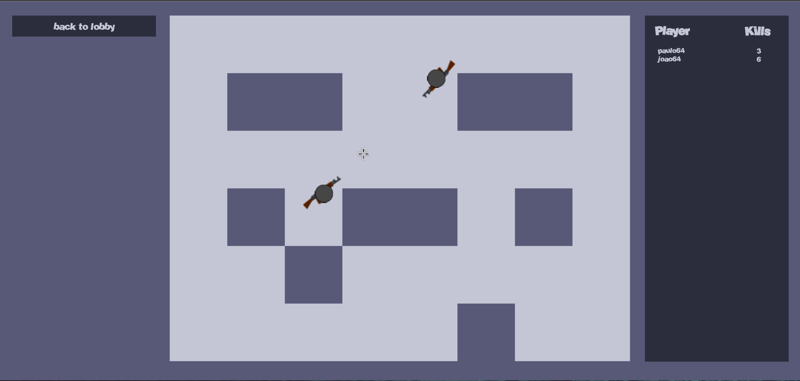
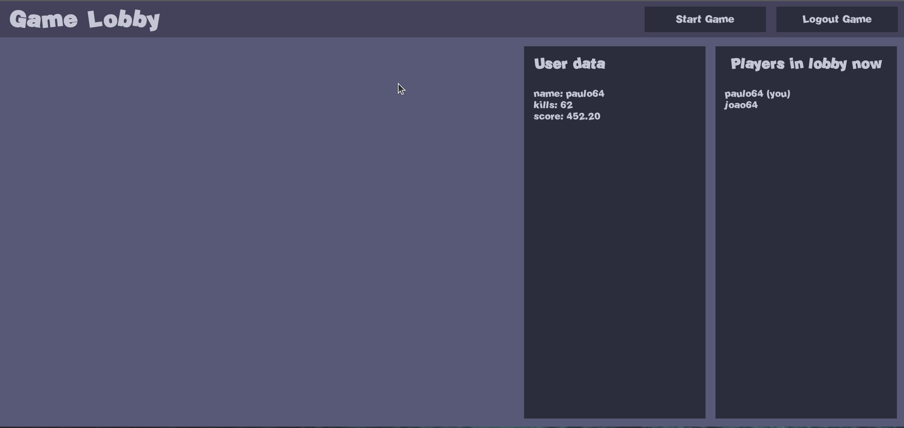

## Java spring boot shooter game

A multiplayer shooter game created with spring boot in backend and vanilla html, css & javascript frontend

### Techs useds

- spring boot
- spring security
- spring websockets
- mongodb
- nginx 

### Running the game

in the game project root, run this following commands

```
docker compose build
```
```
docker compose up
```

and go to [localhost:3000/home](http://localhost:3000/home) in your browser





